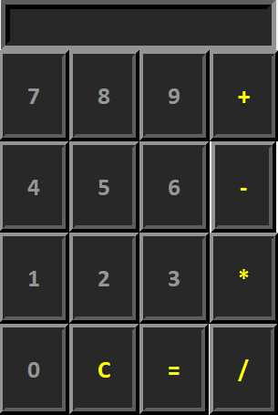

<h1>Calculator</h1>
A calculator written in Python with Lambda functions and Tkinter for the GUI.  

  <kbd>
</img>
  </kbd>

 

<h2>Features</h2>
<ul>
  <li>One</li>
  <li>Two</li>
  <li>Three</li>
</ul>
  
